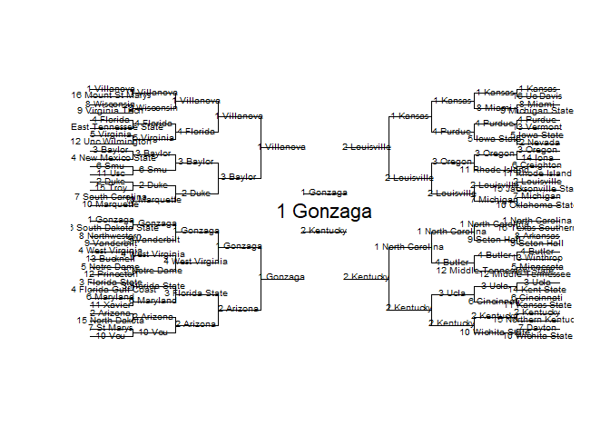

# March Madness Optimization

This is the full code used for the [Shiny march madness app](https://bracketmath.shinyapps.io/ncaa/). You can run the code yourself to customize more things such as increasing the number of simulations, increasing the bracket pool size, changing the projection model, and more. To run, the order of files is: 1. "simulate" 2. "ownership" 3. "optimize brackets" in that order. Below I explain the methodology. <br /> <br />

### 1. Projection and Simulation

The algorithm starts by projecting all the tournament matchups and then simulating the tournament:

``` r
head(probs, 20)
```

    ##                      R1     R2     R3     R4     R5     R6
    ## 1 Gonzaga        0.9748 0.7802 0.5480 0.3884 0.2380 0.1496
    ## 1 Villanova      0.9924 0.7720 0.5412 0.3694 0.2288 0.1446
    ## 1 North Carolina 0.9834 0.7506 0.5394 0.3280 0.2050 0.1058
    ## 1 Kansas         0.9752 0.7284 0.4792 0.2894 0.1562 0.0858
    ## 2 Kentucky       0.9590 0.6556 0.4128 0.2346 0.1372 0.0716
    ## 2 Duke           0.9476 0.6726 0.4074 0.1988 0.0988 0.0532
    ## 2 Louisville     0.9732 0.6258 0.3712 0.2016 0.1044 0.0506
    ## 3 Oregon         0.9530 0.6118 0.3132 0.1562 0.0736 0.0328
    ## 2 Arizona        0.9542 0.5938 0.3628 0.1636 0.0744 0.0314
    ## 3 Ucla           0.9724 0.5878 0.2706 0.1346 0.0670 0.0308
    ## 4 West Virginia  0.9108 0.5810 0.2388 0.1292 0.0590 0.0292
    ## 3 Baylor         0.8718 0.4800 0.2342 0.0956 0.0462 0.0218
    ## 4 Purdue         0.8024 0.4648 0.2088 0.1010 0.0476 0.0214
    ## 3 Florida State  0.8886 0.5768 0.2832 0.1184 0.0496 0.0212
    ## 4 Florida        0.8390 0.4780 0.1828 0.0938 0.0436 0.0200
    ## 5 Virginia       0.7820 0.4002 0.1522 0.0750 0.0342 0.0150
    ## 4 Butler         0.8534 0.4998 0.1980 0.0808 0.0342 0.0138
    ## 10 Wichita State 0.7346 0.2660 0.1336 0.0606 0.0272 0.0120
    ## 6 Smu            0.7854 0.4160 0.2018 0.0782 0.0308 0.0112
    ## 5 Iowa State     0.7088 0.3606 0.1482 0.0700 0.0270 0.0098

Above are the probabilities of teams reaching each round for 2017, 5000 simulations <br /> <br />

### 2. Bracket-Pool Simulation

Then, using [ESPN Pick Percentages](http://games.espn.com/tournament-challenge-bracket/2017/en/whopickedwhom), you can simulate a pool of brackets.

``` r
head(ownership, 20)
```

    ##                      R1     R2     R3     R4     R5     R6
    ## 1 North Carolina 0.9846 0.9492 0.8360 0.4312 0.2714 0.1596
    ## 2 Duke           0.9868 0.9370 0.7672 0.4146 0.2628 0.1276
    ## 1 Villanova      0.9850 0.9114 0.7896 0.4214 0.2536 0.1194
    ## 1 Kansas         0.9864 0.9186 0.7800 0.5200 0.2174 0.1140
    ## 3 Ucla           0.9758 0.8586 0.4618 0.2474 0.1544 0.0828
    ## 1 Gonzaga        0.9820 0.9122 0.6570 0.3734 0.1618 0.0820
    ## 2 Kentucky       0.9786 0.8542 0.4354 0.2214 0.1364 0.0716
    ## 2 Arizona        0.9848 0.9078 0.7346 0.3808 0.1556 0.0642
    ## 2 Louisville     0.9746 0.7122 0.4730 0.1764 0.0588 0.0286
    ## 3 Oregon         0.9652 0.7604 0.2956 0.1130 0.0368 0.0150
    ## 7 Michigan       0.7848 0.2414 0.1528 0.0560 0.0246 0.0118
    ## 4 West Virginia  0.9082 0.4758 0.1452 0.0640 0.0228 0.0082
    ## 3 Baylor         0.9148 0.5470 0.1088 0.0404 0.0186 0.0070
    ## 3 Florida State  0.8680 0.6016 0.1360 0.0562 0.0168 0.0070
    ## 5 Notre Dame     0.8552 0.4406 0.1302 0.0512 0.0178 0.0064
    ## 4 Butler         0.9242 0.6148 0.0810 0.0246 0.0134 0.0060
    ## 4 Florida        0.8760 0.4864 0.0692 0.0254 0.0126 0.0058
    ## 5 Iowa State     0.8354 0.4294 0.0764 0.0376 0.0116 0.0056
    ## 4 Purdue         0.8766 0.4686 0.0708 0.0358 0.0118 0.0054
    ## 10 Wichita State 0.6624 0.1012 0.0370 0.0150 0.0068 0.0044

Above are the ownership percentages by round for the pool of brackets, 5000 brackets. You can start to see that certain teams are overvalued in the pool of brackets compared to their projections (Duke, UNC), while others seem to be undervalued in the pool relative to their projection (Gonzaga) <br /> <br />

### 3. Optimization

Finally, you can apply your scoring to get finishes for each bracket compared to the others, along with mean-points scored for each bracket. With this, you can find different solutions, Ex: 1 Bracket to maximize P(90th percentile). 3 brackets to maximize P(97th), 1 bracket to maximize points, etc. Below is the bracket for 2017 which maximized P(90th percentile).

``` r
bracket<-brackets[which.max(brackets$Prob90), 1:63]
plotBracket(bracket)
```



Although this bracket was not successfull (North Carolina won in 2017), the system is still useful in that it gives you the optimal bracket, given your projections and your scoring system. By changing the projections and running over multiple years, it also allows for some interesting analyses like how many upsets you should typically put in your bracket.
