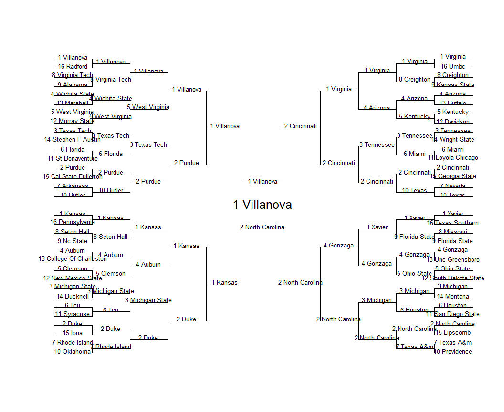

This is the full code used for the [Shiny march madness
app](https://bracketmath.shinyapps.io/ncaa/). You can run the code
yourself to customize more things such as increasing the number of
simulations, increasing the bracket pool size, changing the projection
model, and more. To run, the order of files is: 1-simulate-tournament,
2-simulate-brackets, 3-calculate payouts, 4-optimize-brackets in that
order. The data for the shiny app is in the Shiny folder but it is just
less customizable. Below I explain the methodology.    

### 1. Projection and Simulation

The algorithm starts by projecting all the tournament matchups and then
simulating the tournament:

    head(probs, 20)

    ##                     R1    R2    R3    R4    R5    R6
    ## 1 Villanova      0.982 0.846 0.616 0.452 0.276 0.186
    ## 1 Virginia       0.968 0.762 0.582 0.380 0.254 0.138
    ## 2 Duke           0.976 0.820 0.514 0.338 0.184 0.126
    ## 2 Cincinnati     0.892 0.684 0.414 0.252 0.146 0.076
    ## 2 Purdue         0.964 0.678 0.476 0.212 0.110 0.076
    ## 3 Michigan State 0.908 0.696 0.340 0.210 0.142 0.074
    ## 1 Kansas         0.910 0.716 0.508 0.266 0.120 0.062
    ## 2 North Carolina 0.980 0.794 0.490 0.292 0.154 0.060
    ## 3 Michigan       0.872 0.598 0.298 0.160 0.062 0.032
    ## 3 Tennessee      0.892 0.638 0.338 0.160 0.074 0.026
    ## 4 Gonzaga        0.888 0.648 0.402 0.198 0.078 0.018
    ## 3 Texas Tech     0.874 0.552 0.238 0.074 0.034 0.018
    ## 1 Xavier         0.974 0.660 0.312 0.140 0.060 0.014
    ## 6 Houston        0.652 0.274 0.104 0.048 0.020 0.012
    ## 5 West Virginia  0.836 0.518 0.200 0.100 0.032 0.010
    ## 4 Auburn         0.856 0.548 0.230 0.078 0.028 0.010
    ## 5 Kentucky       0.692 0.362 0.110 0.050 0.030 0.008
    ## 6 Tcu            0.630 0.198 0.072 0.024 0.012 0.008
    ## 10 Butler        0.580 0.198 0.096 0.036 0.008 0.006
    ## 4 Arizona        0.820 0.496 0.156 0.044 0.020 0.004

Above are the probabilities of teams reaching each round for 2018, 500
simulations    

### 2. Bracket-Pool Simulation

Then, using [ESPN Pick
Percentages](http://games.espn.com/tournament-challenge-bracket/2018/en/whopickedwhom),
you can simulate a pool of brackets.

    head(ownership, 20)

    ##           Team_Full    R1    R2    R3    R4    R5    R6
    ## 59       1 Virginia 0.990 0.958 0.682 0.590 0.354 0.182
    ## 58      1 Villanova 0.992 0.942 0.814 0.634 0.296 0.140
    ## 14           2 Duke 0.986 0.892 0.496 0.318 0.184 0.104
    ## 29 3 Michigan State 0.972 0.898 0.436 0.282 0.158 0.098
    ## 21         1 Kansas 0.982 0.914 0.738 0.298 0.164 0.092
    ## 36 2 North Carolina 0.986 0.926 0.608 0.406 0.172 0.072
    ## 64         1 Xavier 0.980 0.838 0.456 0.186 0.074 0.046
    ## 28       3 Michigan 0.968 0.790 0.320 0.190 0.082 0.042
    ## 2         4 Arizona 0.932 0.598 0.198 0.160 0.092 0.040
    ## 41         2 Purdue 0.974 0.826 0.586 0.150 0.068 0.034
    ## 9      2 Cincinnati 0.968 0.836 0.572 0.110 0.066 0.022
    ## 18        4 Gonzaga 0.968 0.688 0.352 0.120 0.058 0.022
    ## 23       5 Kentucky 0.844 0.336 0.090 0.060 0.028 0.016
    ## 55     3 Texas Tech 0.908 0.534 0.150 0.048 0.020 0.014
    ## 61  5 West Virginia 0.858 0.484 0.090 0.058 0.016 0.010
    ## 60  8 Virginia Tech 0.506 0.024 0.016 0.010 0.010 0.006
    ## 51      3 Tennessee 0.944 0.690 0.244 0.030 0.016 0.004
    ## 37     5 Ohio State 0.810 0.246 0.112 0.030 0.008 0.004
    ## 15        6 Florida 0.810 0.364 0.118 0.026 0.008 0.004
    ## 62  4 Wichita State 0.876 0.428 0.048 0.026 0.006 0.004

Above are the ownership percentages by round for the pool of brackets,
500 brackets. You can start to see that certain teams are overvalued in
the pool of brackets compared to their projections, while others seem to
be undervalued in the pool relative to their projection.

### 3. Optimization

Finally, you can apply your scoring to get finishes for each bracket in
the pool compared to eachother across the simulations. You can set up an
optimization to return the optimal bracket(s) for any number of
specifications, Ex: Return 1 Bracket to maximize P(90th percentile). 3
brackets to maximize P(97th), 1 bracket to maximize points, etc. I can
also test out other brackets against the pool of 500 brackets in order
to get alternative brackets which may do well but weren’t included in
the pool.

Below is the bracket which maximized P(90th percentile) for 2018:

    brackets$Prob90<-apply(brackets[, grepl("Percentile", colnames(brackets)) & !grepl("Actual", colnames(brackets))], 1, function(x) sum(x>.90)/sims)
    max(brackets$Prob90) #projected P(90th percentile)

    ## [1] 0.296

    plotBracket(brackets[which.max(brackets$Prob90), 1:63], text.size = .8)

    brackets[which.max(brackets$Prob90), c("Percentile.Actual", "Score.Actual")]

    ##     Percentile.Actual Score.Actual
    ## 104             0.972         1160

Using this system allows you optimize the brackets you enter for march
madness. In addition, it allows you to change the scoring system, pool
sizes, number of brackets entered, and projection system. By testing out
the projected finish based on different strategies like point
maximization, or point maximization in R1-2 only, or other ideas, you
can get an idea of how you should balance expected point maximization
with being contrarian.
